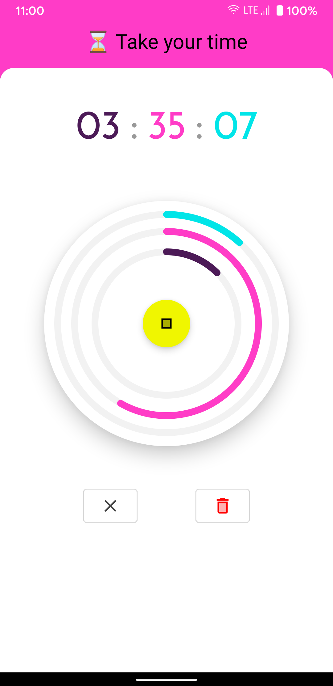
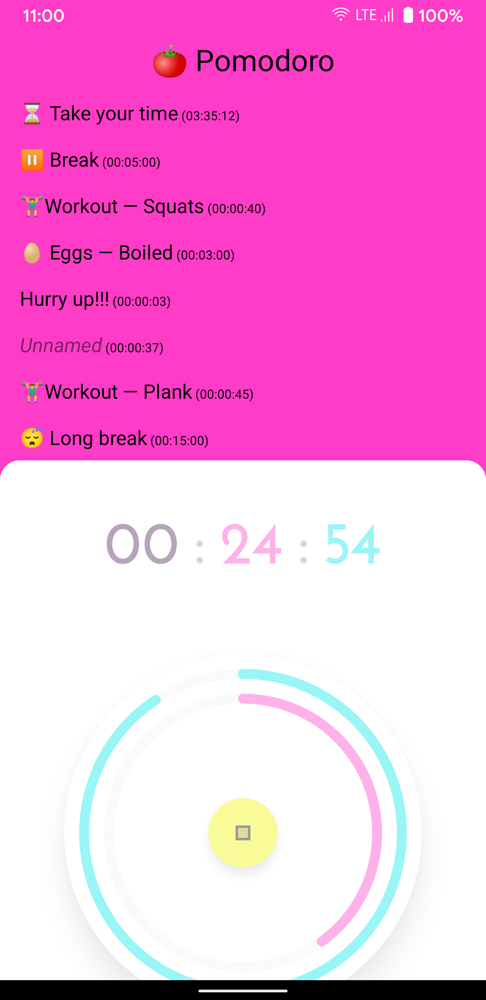
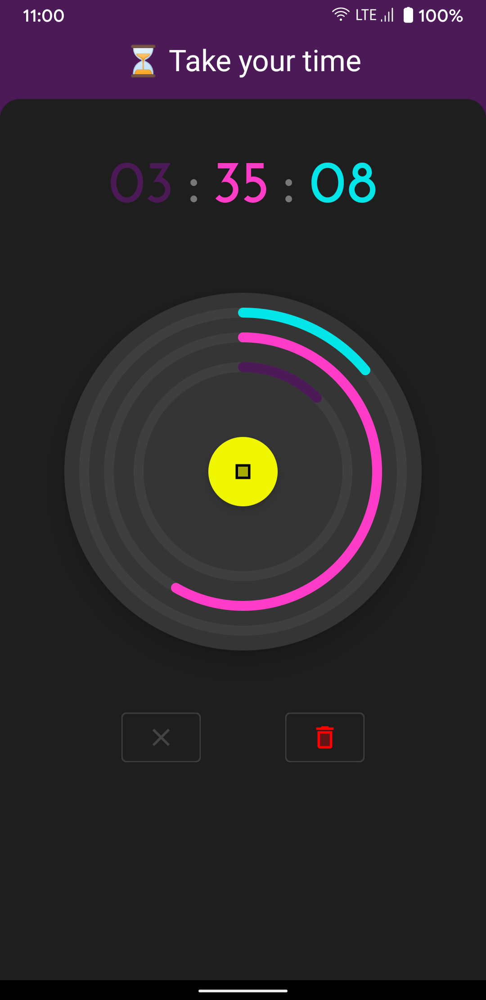
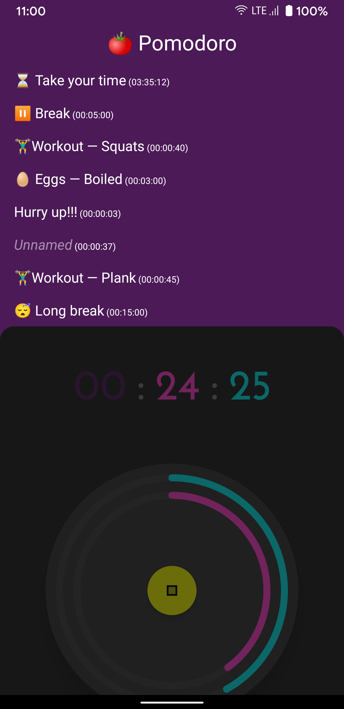

# Countdown timer - Week #2

[](https://github.com/opatry/android-dev-challenge-compose-week2/actions/workflows/Check.yaml)

## :scroll: Description

This app lists timers to launch at will for different needs.
Each unit has its own indicator (for hours, minutes and seconds).

## :bulb: Motivation and Context

The main idea was to bring a really visual way to represent time, using distinct progress for each units with its own nested color circles.
It was tough to deal with time arithmetic and smooth animation each seconds.

I'm kind of satisfied by final visual even if not perfect.
I learn a lot with this challenge #2 (Animation, backdrop (incl. conceal/reveal using `rememberCoroutineScope`), time arithmetic, canvas composable, custom font, `LazyColumn.stickyHeader`).

## :camera_flash: Screenshots

### 🌞 Light Mode
Active timer | Timers
--- | --- |
 | 

### 🌚 Dark Mode
Active timer | Timers
--- | --- |
 | 

## License
```
Copyright 2020 The Android Open Source Project

Licensed under the Apache License, Version 2.0 (the "License");
you may not use this file except in compliance with the License.
You may obtain a copy of the License at

    https://www.apache.org/licenses/LICENSE-2.0

Unless required by applicable law or agreed to in writing, software
distributed under the License is distributed on an "AS IS" BASIS,
WITHOUT WARRANTIES OR CONDITIONS OF ANY KIND, either express or implied.
See the License for the specific language governing permissions and
limitations under the License.
```
